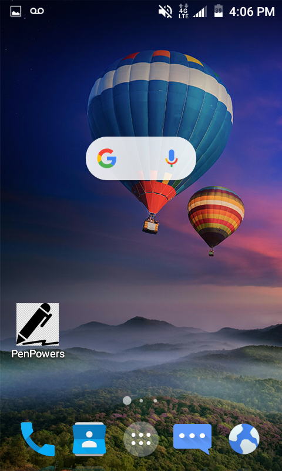
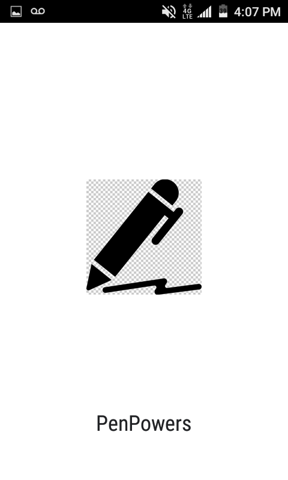
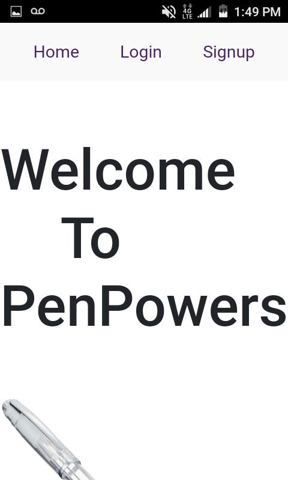
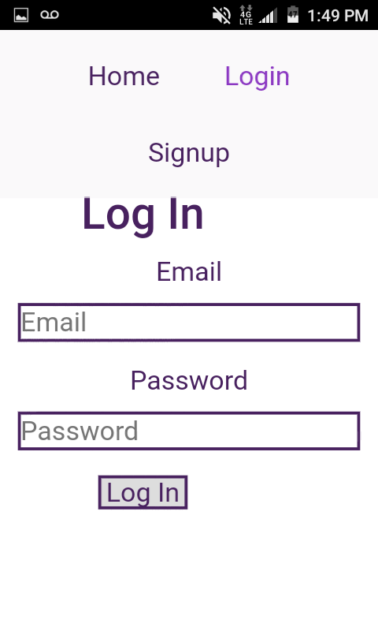
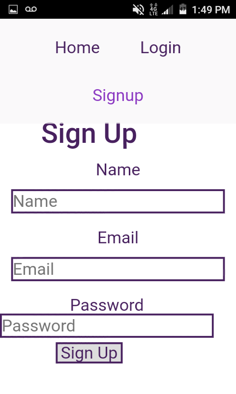
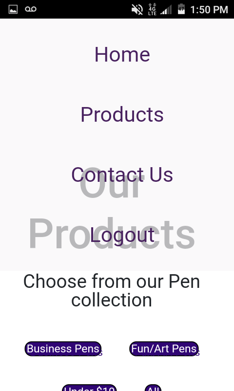

# EcomerceProject Project 6 includes:

## Languages and software tools used:
 - Node.js
 - React
 - MongoDb
 - TDD
 ## Features
#### Client- Contains Ecommerce Website React App
In src file...
- index.js file contain react dom router and other imports
- Components folder contains elements and react website pages
- Routes folder contains apirouter
- Styles folder that contains my css styling for webpage

**_dBschema_** - Contains MySQL Database including tables and queries of products,price and contacts

**_Design-Contains_** ERD and Functional Decompostion design/layouts for Ecom Project

**_Server.js_** - This file contains api endpoints connecting with databse  to display databse info to localhost/server

## Authentication

* To test authentication

Users will not have access to the products page until they...

- Signup:  As a new user on the site type in your name, email , and password 

- Login: As a returning user login to the form with your previous email and password

- Logout: Once current user has gained access to the full site they can logout and return to the log in menu

## Installation

* Open your terminal
 
 To add in node modules

  `npm install` 

To start react app
  ` npm run start`

  To run api testing
  `npm test`

 ## Progressive Web App(PWA)
 Working app for mobile screens (images down below):

| | 
--- | --- | ---
 |  | 

## Heroku App

[Link To Heroku App](https://penpowers.herokuapp.com/)

 ## LICSENSE 
 * MIT

   

